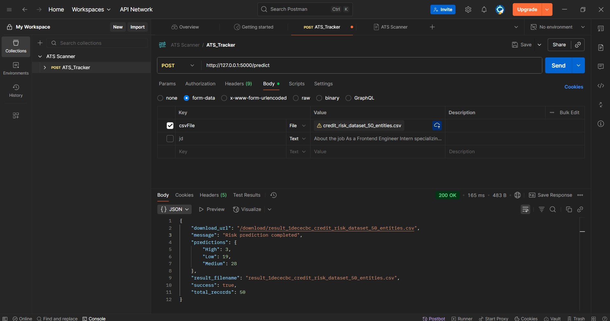

---

# 📊 CréditVue – Credit Risk Gauge

CréditVue is a minimal, real-time credit risk dashboard. It ingests CSV data, stores it in MongoDB, and visualizes risk with a simple RAG (Red/Amber/Green) gauge.

---

## 🚀 Tech Stack

* **Frontend:** React (Vite) — `risk-gauge-insight-main/`
* **Backend:** Node.js + Express — `backend/`
* **Model Service:** Python + Flask — `apiservices/`
* **Database:** MongoDB (local)

---

## 📁 Project Structure

```
project-root/
├─ backend/                  # Express API
├─ risk-gauge-insight-main/  # React app (Vite)
├─ apiservices/              # Flask model server (ai_model_server.py)
└─ README.md
```

---

## ✅ Prerequisites

* Node.js 18+ and npm
* Python 3.10+ (for the model service)
* MongoDB Community Server running locally (`mongod`)

---

## ⚙️ Setup

### 1) Clone the repository

```bash
git clone https://github.com/your-username/creditvue.git
cd inversotie
```

### 2) Backend Setup

```bash
cd backend
npm install
```

Create **`.env`** in `backend/`:

```env
PORT=5000
MONGO_URI=mongodb://127.0.0.1:27017/creditvue
```

Run:

```bash
npm run start
```

### 3) Model Service (Flask)

```bash
cd ../apiservices
python ai_model_server.py
```

This starts the AI model API (default **[http://127.0.0.1:5000](http://127.0.0.1:5000)**).

> ⚠ **Port note:** If your backend also runs on **5000**, change one of them (e.g., set backend `PORT=4000` in `.env`), and make sure your backend’s AI endpoint points to the model’s port.

### 4) Frontend Setup

```bash
cd ../risk-gauge-insight-main
npm install
npm run dev
```

---

## 📡 API (Backend)

* **POST** `/api/uploads` — multipart form upload with field **`csvFile`** (CSV file)

Example:

```bash
curl -X POST "http://127.0.0.1:5000/api/uploads" \
  -H "Accept: application/json" \
  -F "csvFile=@./sample.csv"
```

*(Adjust the host/port if you changed `PORT` in the backend.)*

---

## 🗄️ Database (MongoDB)

* **Database:** `creditvue`
* **Collection:** `entities`
* **Example document:**

```json
{
  "_id": "64a12345c9aef",
  "entity_id": "12345",
  "income": 50000,
  "debt": 10000,
  "risk": "Low",
  "createdAt": "2025-09-28T12:00:00Z"
}
```
📸 ML Model Output (Screenshot)

Response from POST /predict in Postman.

<p align="center">  </p>

---

## 📝 Conclusion

Data flows from CSV → backend → MongoDB → frontend visuals, so teams can **see portfolio risk instantly**, **spot outliers**, and take **evidence-based decisions** with a clean RAG view. The Flask model service enables plug-and-play scoring without blocking the Node API.

---


